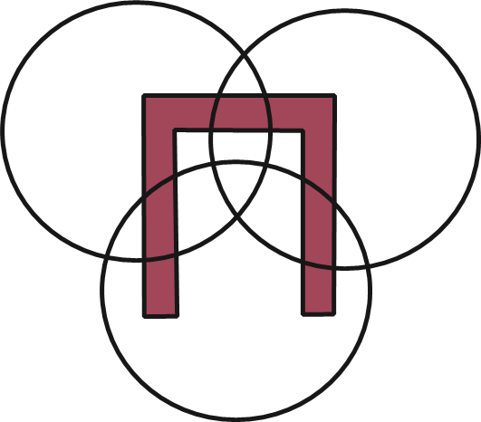
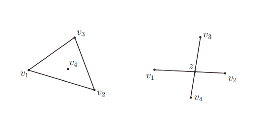

# **Introduction** 
 

### **基本定义和符号:** 
设 $P\subset\mathbb{R}^d$ 是一个凸多胞体[（polytope：A d-polytope $P$ is the convex hull of finitely many points in $\mathbb{R}^d$, or A d-polytope $P$ is the bounded intersection of finitely many half-spaces in $\mathbb{R}^d$）](https://math.berkeley.edu/~charles/whatis/polytopes.pdf)或一个一般的凸体。我们用 $S=\partial P$ 来表示$P$的表面。为了简化符号，我们使用 $area(S)$ 来表示$P$的表面积。我们使用 $area(\cdot)$ 来表示 $(d-1)-维$ 体积：$area(S)=vol_{d-1}(S)$。 若 $P$ 在[超平面](https://cn.bing.com/search?q=%E8%B6%85%E5%B9%B3%E9%9D%A2&form=ANNTH1&refig=04378c8016ab465fb588c839d2abb348) $H$ 的一侧，而 $x\in H$，则称超平面 $H$ 在 $x\in S$ 处 *支撑 ($\mathcal{supporting}$)* $P$。 

&emsp;&emsp;
对于集合 $X\subset\mathbb{R}^d$，我们使用 $cm(X)$ 来表示其[*质心* $^*$](#NOTE_1_1)以及用 $conv(X)$ 来表示集合 $X$ 的凸包。我们使用 $\vert xy\vert$ 来表示点 $x, y \in \mathbb{R}^d$ 之间的距离。另外，$\| \pmb{e}\|$ 表示向量 $\pmb{e}=\vec{xy}$ 的长度。向量永远是加粗的，比如 $O$ 表示原点，而 $\mathbf{0}$ 表示零向量。我们用 $<\pmb{u},\pmb{w}>$ 来表示向量的数量积（Scalar product）。曲面（Surface）上两个点 $x,y \in S$ 的*测地线距离*用 $\vert xy\vert_S$ 来表示。我们使用 $\sphericalangle$ 来表示球角（spherical angles）。  

>注：作者注释道我们仅对分段线性的集合$X$的凸面考虑$cm(X)$，因此这个定义是完备的。原话是We consider cm(X) only for convex of piecewise linear sets X, so it is always well defined. 我没看懂这句话什么意思  

&emsp;&emsp;
我们的图（*graphs*）均由点和边组成，边只有在我们显式表明有向时才是有向的。[在第21节的开始，出于习惯，我们研究带顶点的光滑曲线（ “vertices” *smooth curves*），但为了避免混淆，我们不会在后面的章节中提及它$^*$](#NOTE_1_2)。

>In the beginning of Section 21, following a long standing tradition, we study “vertices” *smooth curves*, but to avoid confusion we never mention them in later sections.

&emsp;&emsp;
出于习惯，我们使用 *polygon* 来表示两个不同的事物：一个简单的闭合分段线性闭合曲线及曲线的内部。在高维空间中，当我们讨论 *space polygons* 时，这两者的相似性（等价性？）不再成立。当我们需要对它们进行区分时，我们会使用 *闭合分段线性曲线* 和 *polygon region* 这两个词语。一个*简单的 polygon* 是一个没有自交点的 *polygon*。我们使用 $Q=[v_1...v_n]$ 来表示一个（周期）顺序顶点为 $v_i$ 的闭合polygon们使用 $(abc)$ 来表示一个三角形，并广义地使用 $(v_0v_1...v_d)$ 来表示一个 $(d+1)$-维的单纯形（simplex）。我们使用 $(u,v)$ 来表示一个开区间（直线段）或两顶点之间的边，使用 $[xy]$ 和 $[x,y]$ 来表示闭区间，它可以在一条直线或者曲线上，使用 $(xy)$ 表示两个点确定的一条直线。  

&emsp;&emsp;
在大部分情况中，我们使用 $polytope$ 来表示有限点的凸包。因此除了第15-17节之外，"polytope"通常和形容词 $convex$ 一同出现。除此之外，我们假设它是满维度的（fully dimensional），即是说不是落在一个仿射超平面上的。在所有其他的情况下，我们使用 $polyhedron$ 来表示凸或非凸的曲面、非紧凑的半空间相交点等。由于我们只关系离散的结果，我们并不限制 polytopes 在 $\mathbb{R}^d$ 上是开的还是闭的，也不指定十分在每种情况下都合适。  

&emsp;&emsp;
我们区分 polytope的 $细分(subdivisions)$ 和 $分解(decompositions)$，前者需要[CW复形（CW complex）](https://cn.bing.com/search?q=CW+complex&cvid=3c10ff08782b4b16941fcd4b357734e1&aqs=edge..69i57j69i60.296j0j1&pglt=163&FORM=ANNTA1&PC=U531)而后者不需要。$三角剖分$ 在表达上过于模糊，因此我们仅仅把它用于单纯的细分。我们称 $分割(dissections)$ 为最简单的分解，称 $全三角剖分(full$ $triangulations)$ 为给定顶点集合的三角剖分（通常给定的定点为一个凸polytope的顶点）。  

&emsp;&emsp;
我们偶尔使用标准的符号来比较函数：$O(\cdot),\;O(\cdot),\;\Omega(\cdot),\;\theta(\cdot)$。我们使用多种箭头形的符号，比如 $\sim,\;\simeq,\;\leftrightarrow,\;\bowtie,\;\asymp,\;\cong$ 等来表示翻转、局部移动和等价关系。我们保持 $\approx$ 为数字上的相似。  

&emsp;&emsp;
最后，在整本书中，$[n]=\{ 1,2,...,n\}$，$\mathbb{N}=\{1,2,...\}$，$\mathbb{Z}_+=\{0,1,2,...\}$，$\mathbb{R}_+=\{x>0\}$，$\mathbb{Q}_+=\{x>0,x\in \mathbb{Q}\}$。我们使用 $\mathbb{R}^d$ 表示d-维欧氏空间，使用 $\mathbb{S}^d$ 表示d-维球，使用 $\mathbb{S}^d_+$ 表示d-维半球，其中 $d\geq 1$。为了简化符号，我们使用 $X-a$ 和 $X+b$ 来表示 $X\diagdown a$ 和 $X\cup b$。  
 

# **Part I** 
## 基本离散几何
 

### **
1. HELLY 定理
**
 

&emsp;&emsp;
我们从Helly理论及其推广入手研究离散几何。这将占据该节与下一节的大部分。尽管这些结论相对的初级、简单，但它们是整个离散几何的核心，并且及其的有用（见第3节和第24节）。

1.1. **Main result in slow motion.** 我们从平面上的经典*Helly定理*开始。  
**定理1.1（Helly）** 设$X_1,...X_n\subset\mathbb{R}^2$ 为满足对于任意 $1 \leqslant i < j < k \leqslant n, 其中n \geqslant 3$，$X_i\cap X_j \cap X_k \neq \varnothing$。则存在点 $z\in X_1,...,X_n$。  

&emsp;&emsp;
也就是说，多个凸集中任意三个相交，则所有凸集相交。凸条件在Helly定理中是必需的，这种必需性在 [图1.1](#FIG1_1) 的例子中展示出。  

图 1.1 凸条件在Helly理论中的必需性

  
 

*证明：* 我们通过对 $n$ 的归纳推理来证明。对于 $n=3$ 我们并不需要证明。对于 $n=4$ ，考虑点 $v_1 \in X_2 \cap X_3 \cap X_4$，$v_2 \in X_1 \cap X_3 \cap X_4$，$v_3 \in X_1 \cap X_2 \cap X_4$，$v_4 \in X_1 \cap X_2 \cap X_3$。这里有两种可能：4个点都在[凸位置$^*$](#NOTE_1_3)或它们之中的其中一个，假设为 $v_4$ ，在剩余三个点 $(v_1v_2v_3)$ 所确定的三角形中。在第二种情况中，$z=v_4$ 显然是成立的。在第一种情况中，取 $z$ 为四边形 $(v_1v_2v_3v_4)$（$4-gon(v_1v_2v_3v_4)$）两对角线的交点。对于 [图1.2](#FIG1_2) 所标记的点我们有：  

$$
z\in conv \{v_1,v_3\}\cap conv \{v_2,v_4\}\subset(X_2\cap X_4)\cap (X_1 \cap X_3),
$$ 其中 $n=4$。

>注：凸位置在原文中为Convex Position。
[In discrete and computational geometry, a set of points in the Euclidean plane or a higher-dimensional Euclidean space is said to be in convex position or convex independent if none of the points can be represented as a convex combination of the others.](https://en.wikipedia.org/wiki/Convex_position) 
在离散计算几何中，若在欧氏或高维欧氏空间中的点集满足任意点不能被其余点的凸组合表示，则称该点集在凸位置上或独立凸集。
  

图 1.2. n=4 情况下的Helly理论

  

&emsp;&emsp;
下面定义在本节通用的符号。记 $X_I= \cap _{i\in I}X_i$，其中 $ I \subset [n]=\{1,...,n\}$。在介绍部分，假设 $n > 4$ 且对任意 $(n-1)$—元素（$(n-1)$-subset）的子集 $i \in [n]$ 有 $X_I \neq \varnothing $。记 $v_i$ 为任意在 $X_{[n]-i}$ 中的点，考虑由 $v_1, v_2, v_3, v_4$ 四个点构成的形状。正如 $n=4$ 的情况下所描述的一样，这些点只能在或不在凸位置。根据上面的讨论，我们能证明在任意情况下存在点 $z\in X_{[n]}$。  

&emsp;&emsp;
这里我们给出高维度下的 Helly 定理：  
**定理 1.2**（*d*-维 Helly 定理）设 $X_1,...,X_n \subset\mathbb{R}^d $ 为 $n \geqslant d+1$ 个凸集，使得对于每个子集 $I \subset [n]， |I| = d+1$ 有 $X_I \neq \varnothing$。则存在点 $z \in X_1, ...,X_n$。